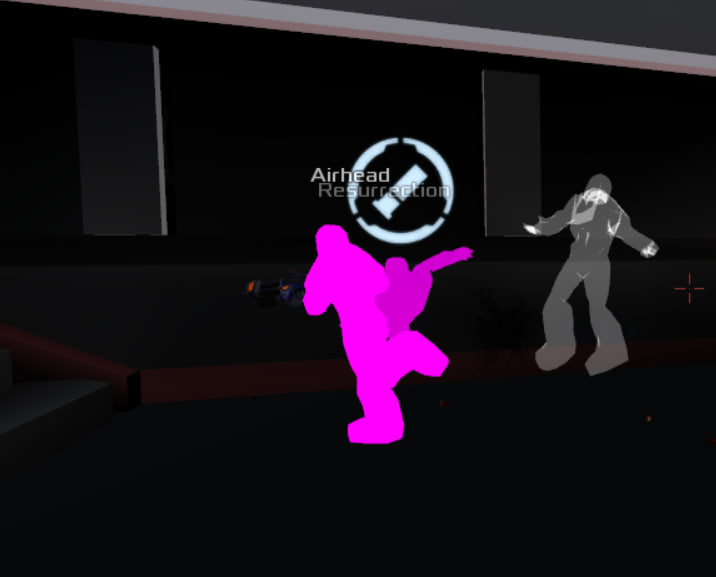

!!! The project is under optimization. The script is running successfully, but slowly. I chose 2 paths for myself, optimizing the go code and create the rust project.



1. Open config
```
C:\Users\USER NAME\Saved Games\xonotic\data\config.cfg
```
2. Edit params
```
seta "cl_forceplayercolors" "1"
seta "cl_forceplayermodels" "1"
```
3. Add new params
```
seta "playermodel" "models/player/megaerebus.iqm"
seta "cl_gentle_gibs" "1"
seta "cl_particles_alpha" "0.2"
seta "cl_particles_sparks" "0"
seta "cl_particles_blood" "0"
seta "r_coronas" "0"
seta "r_bloom" "0"
seta "gl_picmip_world" "10"
seta "gl_texturecompression" "1"
seta "cl_simple_items" "1"
seta "r_drawviewmodel" "0"
seta "cl_reticle" "0"
seta "cl_zoomspeed" "-1"
seta "cl_unpress_zoom_on_weapon_switch" "0"
seta "cl_bobfall" "0"
seta "cl_bobmodel" "0"
seta "cl_bobup" "0"
seta "cl_deathscoreboard" "0"
```
4. Move edit textures (data.7z) from the github repo to a folder  
```
C:\Users\USER NAME\Saved Games\xonotic\data
```


